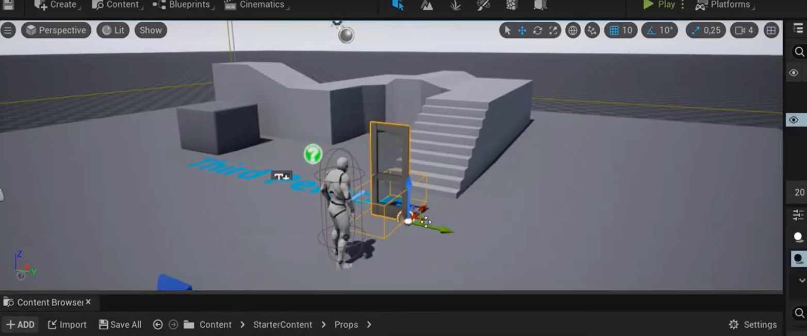

#  5.Automatic-Open-and-Close-door-creation-in-Unreal-Engine-with-collision

# Aim
To implement Automatic-Open-and-Close-door-creation-in-Unreal-Engine-with-collision.
# Procedure
Step 1: Begin by creating a New > Games > Blank > Blueprint project with Starter Content enabled named TimelineDoorActor.

Step 2: Click the Add/Import button to create a new Blueprint Actor class named BP_DoorActor.

Step 3: Double-click the BP_Door Actor from the Content Browser to open it in the Blueprint Editor and open the Class Defaults.

Step 4: Next, from the Components tab click the Add Component button and select Static Mesh to add a new Static Mesh Component.

Step 5: Right-click your static mesh component and select Rename to rename it to DoorFrame.

Step 6: Next, from the Components tab click the Add Component button and select Static Mesh to add a new Static Mesh Component. (Repeating step 3)

Step 7: Right-click your static mesh component and select Rename to rename it to Door.

Step 8: Click Add Component, select Box Collision from the dropdown menu, and rename it to Box.

Step 9: Next, open the Event Graph, right-clickthe graph, and choose Add Timeline from the Blueprint Context Menu. Name your Timeline DoorTimelineComponent.

Step 10: Begin by double-clicking the DoorTimelineComponent in the Event Graph to open the Timeline Editor.

Step 11: Click Add Float Curve to add a new curve to the track and name the curve DoorRotation

Step 12: Shift select both your keys, right-click, and from the Key Interpolation dropdown menu select Auto interpolation.

Step 13: Save your float track.

# Output
Youtube link:https://youtu.be/2nwTOWHUKIY

# Result
Thus Automatic-Open-and-Close-door-creation-in-Unreal-Engine-with-collision is implemented.
